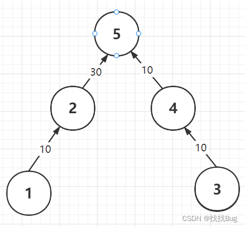
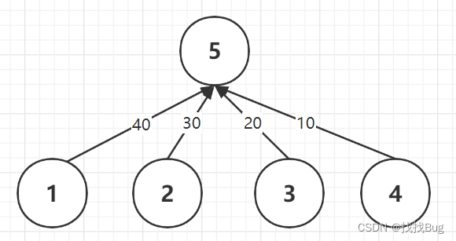
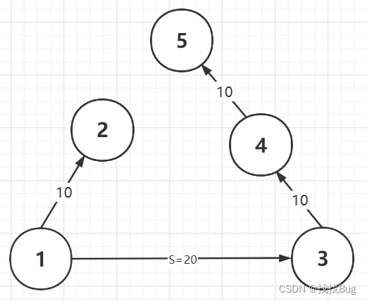
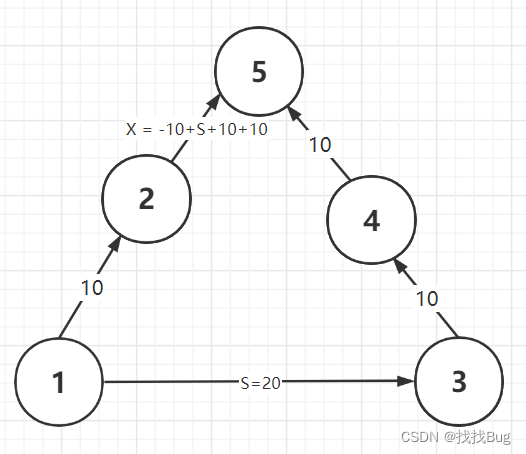

## 并查集
并查集主要描述的是集合与集合之间的关系，即某两个节点是否在同一个集合。
然而，带权并查集不仅可以描述集合之间的关系，而且还描述了节点与节点之间的关系，即节点与节点之间的关系用权值来表示。在带权并查集中，核心的两个操作为：

- 路径压缩操作：查找节点x的根节点同时，压缩x到根节点的路径，使下一次查找x的根节点时，只需要O(1)时间复杂度就可以找到x的根节点；除此之外，还需要更新权值。
- 合并操作：合并时，不只是单纯将节点x的根节点xBoot与节点y的根节点yBoot连接起来，还需要更新xBoot到yBoot的权值。

### 路径压缩图解：
查找节点1和节点3的根节点5时，会产生路径压缩和权值更新。

__压缩前__：


 压缩后：可以清楚地看到，每个节点都直接连接到了根节点5，且权值都更新为从节点i到根节点root的路径权值和。

 

__代码__
```cpp
int find(int x)
{
	if (x != parent[x])
	{
		int t = parent[x];
		parent[x] = find(parent[x]);
		value[x] += value[t];
	}
	return parent[x];
}
```



合并时，将2指向5，且由于【1->2->5】路径的权值和与【1->3->4->5】路径的权值和相等，所以【2->5】的权值为X = -10 + S + 10 + 10。



### 合并
```cpp
	// 找根节点，并压缩路径
int l_Father = findFather(l, father, value);
int r_Father = findFather(r, father, value);
if (l_Father != r_Father) {
// 合并l和r的集合，并更新权值
// 合并规则，将小根节点集合指向大根节点集合
int small = l_Father > r_Father ? r_Father : l_Father;
int big = small == r_Father ? l_Father : r_Father;
father[small] = big;
value[small] = Math.abs(-value[l] + value[r] + s);
}
```
## 例题
[例题](https://www.dotcpp.com/oj/problem2671.html)

根据前缀和的经验，我们知道区间[ l , r ] [l, r][l,r]的和可以表示为d [ r ] − d [ l − 1 ] d[r] - d[l - 1]d[r]−d[l−1]，其中d dd为前缀和数组，这道题差不多是反着过来的，题目会给定若干组区间和，然后需要根据这些信息去推导其他区间的区间和，第一眼看了是完全懵逼的，看了一位大佬的题解后【大佬贴贴】，明白可以使用带权并查集来做。

前缀和是第一个元素为参照，陆续求出后续元素的累加和，利用区间相减的原则推导出某段区间的和。使用带权并查集来做可以类比一下，我们以并查集的根节点为参照，如d [ r ] d[r]d[r]就表示r rr结点到所在并查集的距离，同理对于[ l , r ] [l, r][l,r]的区间和也可以使用d [ r ] − d [ l − 1 ] d[r]-d[l-1]d[r]−d[l−1]来表示。假设区间[ l , r ] [l, r][l,r]的区间和为s ss，由于[ l , r ] [l, r][l,r]区间和表示为d [ r ] − d [ l − 1 ] d[r]-d[l-1]d[r]−d[l−1]，也就是r rr到根的距离与l − 1 l-1l−1到根的距离之差，我们可以将r rr所在并查集和l − 1 l-1l−1所在并查集进行合并，为了方便表示不妨记录t = l − 1 t=l-1t=l−1。

合并前：s = d [ r ] − d [ t ] s=d[r]-d[t]s=d[r]−d[t]
