# 一：综述
假设有编号从1到n的n个点，每个点都存了一些信息，用[L,R]表示下标从L到R的这些点。
线段树的用处就是，对编号连续的一些点进行修改或者统计操作，修改和统计的复杂度都是O(log2(n)).

线段树的原理，就是，将[1,n]分解成若干特定的子区间(数量不超过4*n),然后，将每个区间[L,R]都分解为
少量特定的子区间，通过对这些少量子区间的修改或者统计，来实现快速对[L,R]的修改或者统计。

由此看出，用线段树统计的东西，必须符合区间加法，否则，不可能通过分成的子区间来得到[L,R]的统计结果。

#### (1)符合区间加法的原则：
- 数字之和——总数字之和 = 左区间数字之和 + 右区间数字之和
- 最大公因数(GCD)——总GCD = gcd( 左区间GCD , 右区间GCD );
- 最大值——总最大值=max(左区间最大值，右区间最大值)
- 不符合区间加法的例子：
- 众数——只知道左右区间的众数，没法求总区间的众数
- 01序列的最长连续零——只知道左右区间的最长连续零，没法知道总的最长连续零

一个问题，只要能化成对一些连续点的修改和统计问题，基本就可以用线段树来解决了，具体怎么转化在第六节会讲。
由于点的信息可以千变万化，所以线段树是一种非常灵活的数据结构，可以做的题的类型特别多，只要会转化。
线段树当然是可以维护线段信息的，因为线段信息也是可以转换成用点来表达的（每个点代表一条线段）。
所以在以下对结构的讨论中，都是对点的讨论，线段和点的对应关系在第七节扫描线中会讲。


# 二：原理
（注：由于线段树的每个节点代表一个区间，以下叙述中不区分节点和区间，只是根据语境需要，选择合适的词）
线段树本质上是维护下标为1,2,..,n的n个按顺序排列的数的信息，所以，其实是“点树”，是维护n的点的信息，至于每个点的数据的含义可以有很多，
在对线段操作的线段树中，每个点代表一条线段，在用线段树维护数列信息的时候，每个点代表一个数，但本质上都是每个点代表一个数。以下，在讨论线段树的时候，区间[L,R]指的是下标从L到R的这(R-L+1)个数，而不是指一条连续的线段。只是有时候这些数代表实际上一条线段的统计结果而已。

线段树是将每个区间[L,R]分解成[L,M]和[M+1,R] (其中M=(L+R)/2 这里的除法是整数除法，即对结果下取整)直到 L==R 为止。 
开始时是区间[1,n] ,通过递归来逐步分解，假设根的高度为1的话，树的最大高度为（n>1）。
线段树对于每个n的分解是唯一的，所以n相同的线段树结构相同，这也是实现可持久化线段树的基础。
下图展示了区间[1,13]的分解过程：
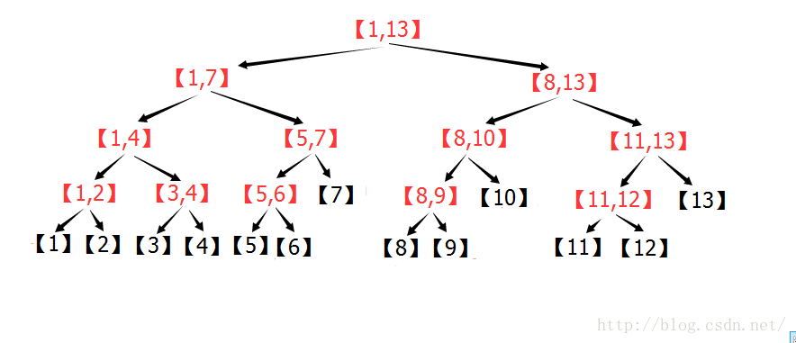

上图中，每个区间都是一个节点，每个节点存自己对应的区间的统计信息。

#### (1)线段树的点修改：

假设要修改[5]的值，可以发现，每层只有一个节点包含[5],所以修改了[5]之后，只需要每层更新一个节点就可以线段树每个节点的信息都是正确的，所以修改次数的最大值为层数。
复杂度O(log2(n))

#### (2)线段树的区间查询：

线段树能快速进行区间查询的基础是下面的定理：
定理：n>=3时，一个[1,n]的线段树可以将[1,n]的任意子区间[L,R]分解为不超过个子区间。
这样，在查询[L,R]的统计值的时候，只需要访问不超过个节点，就可以获得[L,R]的统计信息，实现了O(log2(n))的区间查询。

下面给出证明：

###### (2.1)一个粗略的证明（结合下图）：
先考虑树的最下层，将所有在区间[L,R]内的点选中，然后，若相邻的点的直接父节点是同一个，那么就用这个父节点代替这两个节点（父节点在上一层）。这样操作之后，本层最多剩下两个节点。若最左侧被选中的节点是它父节点的右子树，那么这个节点会被剩下。若最右侧被选中的节点是它的父节点的左子树，那么这个节点会被剩下。中间的所有节点都被父节点取代。
对最下层处理完之后，考虑它的上一层，继续进行同样的处理，可以发现，每一层最多留下2个节点，其余的节点升往上一层，这样可以说明分割成的区间（节点）个数是大概是树高的两倍左右。

下图为n=13的线段树，区间[2,12]，按照上面的叙述进行操作的过程图：
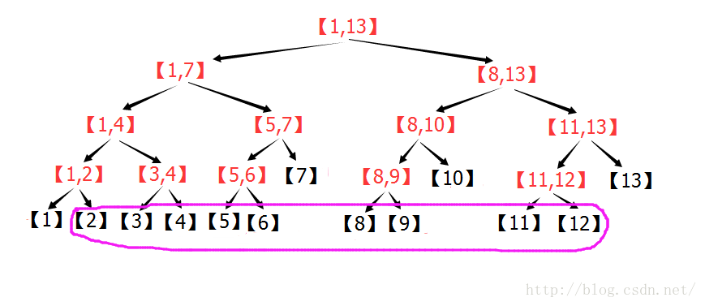
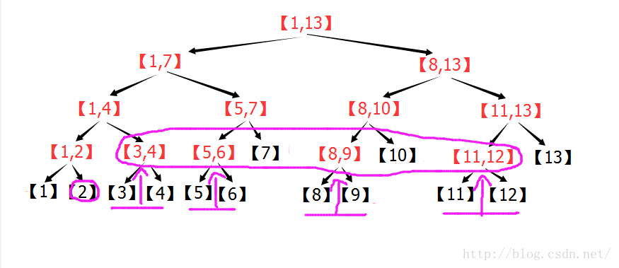
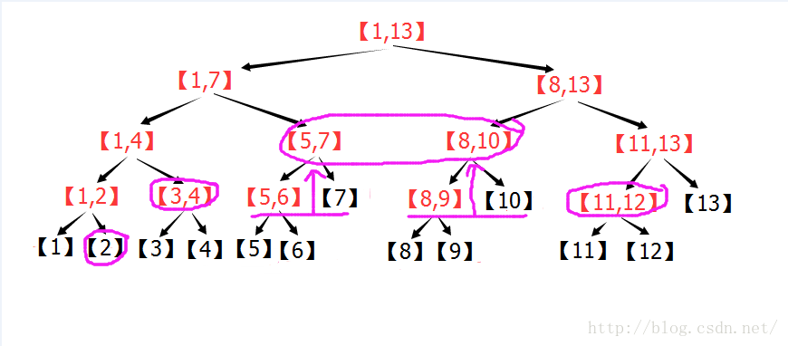
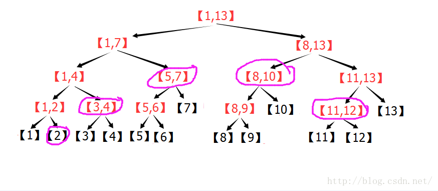
由图可以看出：在n=13的线段树中，[2,12]=[2] + [3,4] + [5,7] + [8,10] + [11,12] 。

#### (3)线段树的区间修改：
线段树的区间修改也是将区间分成子区间，但是要加一个标记，称作懒惰标记。
##### (3.1)标记的含义：
本节点的统计信息根据标记更新，但是本节点的子节点仍需要进行更新。
即，如果要给一个区间的所有值都加上1，那么，实际上并没有给这个区间的所有值都加上1，
而是打个标记，记下来，这个节点所包含的区间需要加1.

打上标记后，要根据标记更新本节点的统计信息-即属性，
比如，如果本节点维护的属性是区间和，而本节点包含5个数，那么，打上+1的标记之后，要给本节点维护的和+5。
这是向下延迟修改，但是向上显示的信息是修改以后的信息，所以查询的时候可以得到正确的结果。
有的标记之间会相互影响，所以比较简单的做法是，每递归到一个区间，首先下推标记（若本节点有标记，就下推标记），
然后再打上新的标记，这样仍然每个区间操作的复杂度是O(log2(n))。

标记有相对标记和绝对标记之分：
相对标记是将区间的所有数+a之类的操作，标记之间可以共存，跟打标记的顺序无关（跟顺序无关才是重点）。
所以，可以在区间修改的时候不下推标记，留到查询的时候再下推。
注意：如果区间修改时不下推标记，那么PushUp函数中，必须考虑本节点的标记。而如果所有操作都下推标记，那么PushUp函数可以不考虑本节点的标记，因为本节点的标记一定已经被下推了（也就是对本节点了）

绝对标记是将区间的所有数变成a之类的操作，打标记的顺序直接影响结果，
所以这种标记在区间修改的时候必须下推旧标记，不然会出错。

注意，有多个标记的时候，标记下推的顺序也很重要，错误的下推顺序可能会导致错误。

之所以要区分两种标记，是因为非递归线段树只能维护相对标记。
因为非递归线段树是自底向上直接修改分成的每个子区间，所以根本做不到在区间修改的时候下推标记。
非递归线段树一般不下推标记，而是自下而上求答案的过程中，根据标记更新答案。

#### (4)线段树的存储结构：
线段树是用数组来模拟树形结构，对于每一个节点R ,左子节点为 2*R (一般写作R<<1)右子节点为 2*R+1（一般写作R<<1|1）
然后以1为根节点，所以，整体的统计信息是存在节点1中的。
这么表示的原因看下图就很明白了，左子树的节点标号都是根节点的两倍，右子树的节点标号都是左子树+1：

线段树需要的数组元素个数是：,一般都开4倍空间，比如： int A[n<<2];


## 三：递归实现
以下以维护数列区间和的线段树为例，演示最基本的线段树代码。

~~~cpp
/*-----定义：----*/
#define maxn 100007  //元素总个数  
#define ls l,m,rt<<1  
#define rs m+1,r,rt<<1|1  
int Sum[maxn<<2],Add[maxn<<2];//Sum求和，Add为懒惰标记   
int A[maxn],n;//存原数组数据下标[1,n]   
/*-----建树：----*/

//PushUp函数更新节点信息 ，这里是求和  
void PushUp(int rt){Sum[rt]=Sum[rt<<1]+Sum[rt<<1|1];}  
//Build函数建树   
void Build(int l,int r,int rt){ //l,r表示当前节点区间，rt表示当前节点编号  
    if(l==r) {//若到达叶节点   
        Sum[rt]=A[l];//储存数组值   
        return;  
    }  
    int m=(l+r)>>1;  
    //左右递归   
    Build(l,m,rt<<1);  
    Build(m+1,r,rt<<1|1);  
    //更新信息   
    PushUp(rt);  
}  

/*-----点修改：----*/
假设A[L]+=C:
void Update(int L,int C,int l,int r,int rt){//l,r表示当前节点区间，rt表示当前节点编号  
    if(l==r){//到叶节点，修改   
        Sum[rt]+=C;  
        return;  
    }  
    int m=(l+r)>>1;  
    //根据条件判断往左子树调用还是往右   
    if(L <= m) Update(L,C,l,m,rt<<1);  
    else       Update(L,C,m+1,r,rt<<1|1);  
    PushUp(rt);//子节点更新了，所以本节点也需要更新信息   
}   

/*-----区间修改：----*/

假设A[L,R]+=C
void Update(int L,int R,int C,int l,int r,int rt){//L,R表示操作区间，l,r表示当前节点区间，rt表示当前节点编号   
    if(L <= l && r <= R){//如果本区间完全在操作区间[L,R]以内   
        Sum[rt]+=C*(r-l+1);//更新数字和，向上保持正确  
        Add[rt]+=C;//增加Add标记，表示本区间的Sum正确，子区间的Sum仍需要根据Add的值来调整  
        return ;   
    }  
    int m=(l+r)>>1;  
    PushDown(rt,m-l+1,r-m);//下推标记  
    //这里判断左右子树跟[L,R]有无交集，有交集才递归   
    if(L <= m) Update(L,R,C,l,m,rt<<1);  
    if(R >  m) Update(L,R,C,m+1,r,rt<<1|1);   
    PushUp(rt);//更新本节点信息   
}   

/*-----区间查询：----*/

询问A[L,R]的和
首先是下推标记的函数：
void PushDown(int rt,int ln,int rn){  
    //ln,rn为左子树，右子树的数字数量。   
    if(Add[rt]){  
        //下推标记   
        Add[rt<<1]+=Add[rt];  
        Add[rt<<1|1]+=Add[rt];  
        //修改子节点的Sum使之与对应的Add相对应   
        Sum[rt<<1]+=Add[rt]*ln;  
        Sum[rt<<1|1]+=Add[rt]*rn;  
        //清除本节点标记   
        Add[rt]=0;  
    }  
}  

然后是区间查询的函数：
int Query(int L,int R,int l,int r,int rt){//L,R表示操作区间，l,r表示当前节点区间，rt表示当前节点编号  
    if(L <= l && r <= R){  
        //在区间内，直接返回   
        return Sum[rt];  
    }  
    int m=(l+r)>>1;  
    //下推标记，否则Sum可能不正确  
    PushDown(rt,m-l+1,r-m);   
      
    //累计答案  
    int ANS=0;  
    if(L <= m) ANS+=Query(L,R,l,m,rt<<1);  
    if(R >  m) ANS+=Query(L,R,m+1,r,rt<<1|1);  
    return ANS;  
}   

/*-----函数调用----*/


//建树   
Build(1,n,1);   
//点修改  
Update(L,C,1,n,1);  
//区间修改   
Update(L,R,C,1,n,1);  
//区间查询   
int ANS=Query(L,R,1,n,1);  
~~~


## 四：非递归原理
非递归的思路很巧妙，思路以及部分代码实现 来自  清华大学 张昆玮 《统计的力量》 ，有兴趣可以去找来看。
非递归的实现，代码简单（尤其是点修改和区间查询），速度快，建树简单，遍历元素简单。总之能非递归就非递归吧。
不过，要支持区间修改的话，代码会变得复杂，所以区间修改的时候还是要取舍。有个特例，如果区间修改，但是只需要
在所有操作结束之后，一次性下推所有标记，然后求结果，这样的话，非递归写起来也是很方便的。
下面先讲思路，再讲实现。

#### (1)点修改：
非递归的思想总的来说就是自底向上进行各种操作。回忆递归线段树的点修改，首先由根节点1向下递归，找到对应的叶
节点，然后，修改叶节点的值，再向上返回，在函数返回的过程中，更新路径上的节点的统计信息。而非递归线段树的思路是，
如果可以直接找到叶节点，那么就可以直接从叶节点向上更新，而一个节点找父节点是很容易的，编号除以2再下取整就行了。
那么，如何可以直接找到叶节点呢？非递归线段树扩充了普通线段树(假设元素数量为n)，使得所有非叶结点都有两个子结点且叶子结点都在同一层。
来观察一下扩充后的性质：
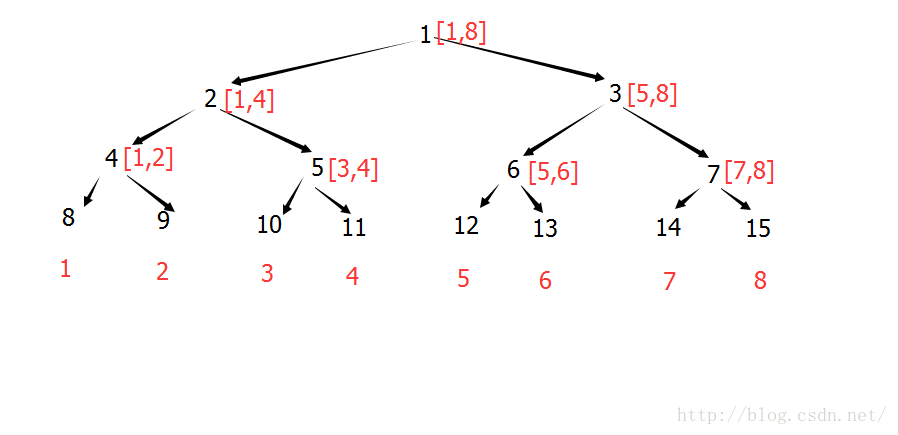

可以注意到红色和黑色数字的差是固定的，如果事先算出这个差值，就可以直接找到叶节点。

注意：区分3个概念：原数组下标，线段树中的下标和存储下标。
原数组下标，是指，需要维护统计信息（比如区间求和）的数组的下标，这里都默认下标从1开始（一般用A数组表示）
线段树下标，是指，加入线段树中某个位置的下标，比如，原数组中的第一个数，一般会加入到线段树中的第二个位置，
为什么要这么做，后面会讲。
存储下标，是指该元素所在的叶节点的编号，即实际存储的位置。

【在上面的图片中，红色为原数组下标，黑色为存储下标】
有了这3个概念，下面开始讲区间查询。

点修改下的区间查询：
首先，区间的划分没有变，现在关键是如何直接找到被分成的区间。原来是递归查找，判断左右子区间跟[L,R]是否有交点，
若有交点则向下递归。现在要非递归实现，这就是巧妙之处，见下图，以查询[3,11]为例子。
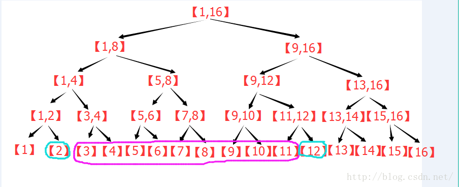
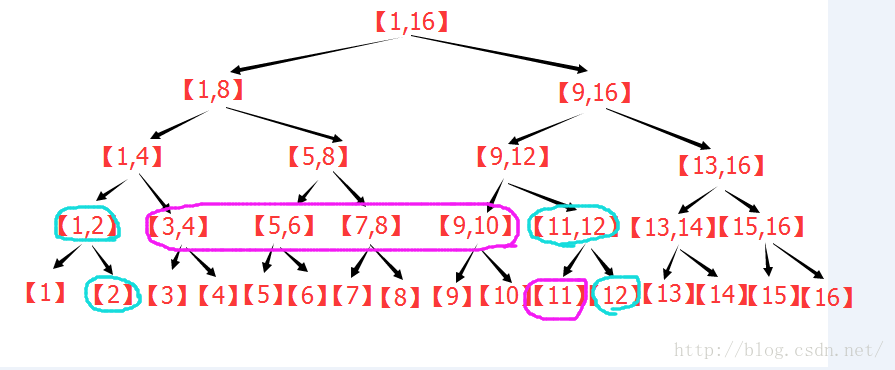

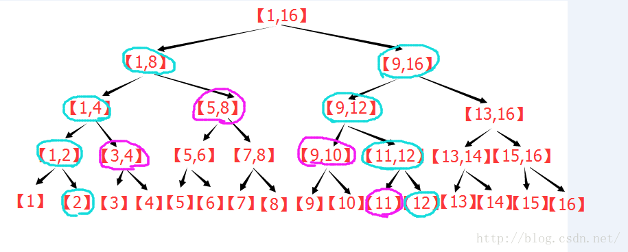
其实，容易发现，紫色部分的变化，跟原来分析线段树的区间分解的时候是一样的规则，图中多的蓝色是什么意思呢？
首先注意到，蓝色节点刚好在紫色节点的两端。
回忆一下，原来线段树在区间逐层被替代的过程中，哪些节点被留了下来？最左侧的节点，若为其父节点的右子节点，则留下。
最右侧的节点，若为其父节点的左子节点则留下。那么对于包裹着紫色的蓝色节点来看，刚好相反。
比如，以左侧的的蓝色为例，若该节点是其父节点的右子节点，就证明它右侧的那个紫色节点不会留下，会被其父替代，所以没必要在这一步计算，若该节点是其父节点的左子节点，就证明它右侧的那个紫色节点会留在这一层，所以必须在此刻计算，否则以后都不会再计算这个节点了。这样逐层上去，容易发现，对于左侧的蓝色节点来说，只要它是左子节点，那么就要计算对应的右子节点。同理，对于右侧的蓝色节点，只要它是右子节点，就需要计算它对应的左子节点。这个计算一直持续到左右蓝色节点的父亲为同一个的时候，才停止。于是，区间查询，其实就是两个蓝色节点一路向上走，在路径上更新答案。这样，区间修改就变成了两条同时向根走的链，明显复杂度O(log2(n))。并且可以非递归实现。
至此，区间查询也解决了，可以直接找到所有分解成的区间。
但是有一个问题，如果要查询[1,5]怎么办？[1]左边可是没地方可以放置蓝色节点了。
问题的解决办法简单粗暴，原数组的1到n就不存在线段树的1到n了，而是存在线段树的2到n+1,
而开始要建立一颗有n+2个元素的树，空出第一个和最后一个元素的空间。

现在来讲如何对线段树进行扩充。

再来看这个二叉树，令N=8;注意到，该树可以存8个元素，并且[1..7]是非叶节点，[8..15]是叶节点。
也就是说，左下角为N的二叉树，可以存N个元素，并且[1..N-1]是非叶节点,[N..2N-1]是叶节点。
并且，线段树下标+N-1=存储下标 （还记不记得原来对三个下标的定义）

这时，这个线段树存在两段坐标映射：
原数组下标+1=线段树下标
线段树下标+N-1=存储下标 
联立方程得到：原数组下标+N=存储下标
于是从原数组下标到存储下标的转换及其简单。

下一个问题：N怎么确定？
上面提到了，N的含义之一是，这棵树可以存N个元素，也就是说N必须大于等于n+2
于是，N的定义，N是大于等于n+2的，某个2的次方。

区间修改下的区间查询：
方法之一：如果题目许可，可以直接打上标记，最后一次下推所有标记，然后就可以遍历叶节点来获取信息。
方法之二：如果题目查询跟修改混在一起，那么，采用标记永久化思想。也就是，不下推标记。
递归线段树是在查询区间的时候下推标记，使得到达每个子区间的时候，Sum已经是正确值。
非递归没法这么做，非递归是从下往上，遇到标记就更新答案。
这题是Add标记，一个区间Add标记表示这个区间所有元素都需要增加Add
Add含义不变，Add仍然表示本节点的Sum已经更新完毕，但是子节点的Sum仍需要更新.
现在就是如何在查询的时候根据标记更新答案。
观察下图：
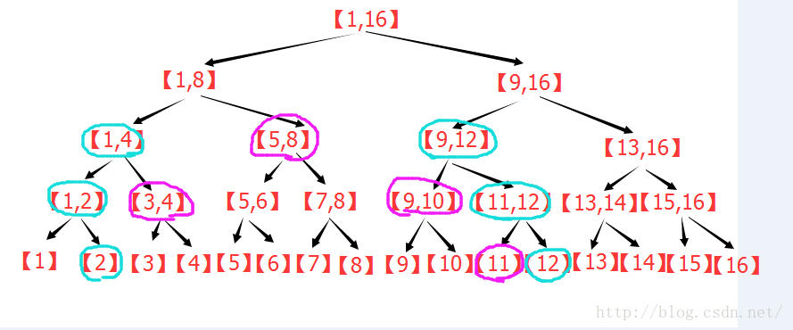
左边的蓝色节点从下往上走，在蓝色节点到达[1,4]时，注意到，左边蓝色节点之前计算过的所有节点（即[3,4]）都是目前蓝色节点的子节点也就是说，当前蓝色节点的Add是要影响这个节点已经计算过的所有数。多用一个变量来记录这个蓝色节点已经计算过多少个数，根据个数以及当前蓝色节点的Add，来更新最终答案。

更新完答案之后，再加上[5,8]的答案，同时当前蓝色节点计算过的个数要+4(因为[5,8]里有4个数)
然后当这个节点到达[1,8]节点时，可以更新[1,8]的Add.
这里，本来左右蓝色节点相遇之后就不再需要计算了，但是由于有了Add标记，左右蓝色节点的公共祖先上的Add标记会影响目前的所有数，所以还需要一路向上查询到根，沿路根据Add更新答案。

区间修改：
这里讲完了查询，再来讲讲修改，
修改的时候，给某个区间的Add加上了C，这个区间的子区间向上查询时，会经过这个节点，也就是会计算这个Add,但是
如果路径经过这个区间的父节点，就不会计算这个节点的Add,也就会出错。这里其实跟递归线段树一样，改了某个区间的Add
仍需要向上更新所有包含这个区间的Sum，来保持上面所有节点的正确性。

五：非递归实现
以下以维护数列区间和的线段树为例，演示最基本的非递归线段树代码。

```cpp
//   定义：
#define maxn 100007  
int A[maxn],n,N;//原数组,n为原数组元素个数 ,N为扩充元素个数   
int Sum[maxn<<2];//区间和   
int Add[maxn<<2];//懒惰标记   

//  建树
void Build(int n){  
    //计算N的值   
    N=1;while(N < n+2) N <<= 1;  
    //更新叶节点   
    for(int i=1;i<=n;++i) Sum[N+i]=A[i];//原数组下标+N=存储下标  
    //更新非叶节点   
    for(int i=N-1;i>0;--i){  
        //更新所有非叶节点的统计信息   
        Sum[i]=Sum[i<<1]+Sum[i<<1|1];  
        //清空所有非叶节点的Add标记   
        Add[i]=0;  
    }  
}  

A[L]+=C
//  点修改：
void Update(int L,int C){  
    for(int s=N+L;s;s>>=1){  
        Sum[s]+=C;  
    }  
}   

(3)点修改下的区间查询：
/*
求A[L..R]的和（点修改没有使用Add所以不需要考虑）
代码非常简洁，也不难理解,
s和t分别代表之前的论述中的左右蓝色节点，其余的代码根据之前的论述应该很容易看懂了。
s^t^1 在s和t的父亲相同时值为0，终止循环。
两个if是判断s和t分别是左子节点还是右子节点，根据需要来计算Sum*/
int Query(int L,int R){  
    int ANS=0;  
    for(int s=N+L-1,t=N+R+1;s^t^1;s>>=1,t>>=1){  
        if(~s&1) ANS+=Sum[s^1];  
        if( t&1) ANS+=Sum[t^1];  
    }  
    return ANS;  
}   

//区间修改：

A[L..R]+=C
<span style="font-size:14px;">//  
void Update(int L,int R,int C){  
    int s,t,Ln=0,Rn=0,x=1;  
    //Ln:  s一路走来已经包含了几个数  
    //Rn:  t一路走来已经包含了几个数  
    //x:   本层每个节点包含几个数  
    for(s=N+L-1,t=N+R+1;s^t^1;s>>=1,t>>=1,x<<=1){  
        //更新Sum  
        Sum[s]+=C*Ln;  
        Sum[t]+=C*Rn;  
        //处理Add  
        if(~s&1) Add[s^1]+=C,Sum[s^1]+=C*x,Ln+=x;  
        if( t&1) Add[t^1]+=C,Sum[t^1]+=C*x,Rn+=x;  
    }  
    //更新上层Sum  
    for(;s;s>>=1,t>>=1){  
        Sum[s]+=C*Ln;  
        Sum[t]+=C*Rn;  
    }   
} </span>  


//  区间修改下的区间查询：
求A[L..R]的和

int Query(int L,int R){  
    int s,t,Ln=0,Rn=0,x=1;  
    int ANS=0;  
    for(s=N+L-1,t=N+R+1;s^t^1;s>>=1,t>>=1,x<<=1){  
        //根据标记更新   
        if(Add[s]) ANS+=Add[s]*Ln;  
        if(Add[t]) ANS+=Add[t]*Rn;  
        //常规求和   
        if(~s&1) ANS+=Sum[s^1],Ln+=x;  
        if( t&1) ANS+=Sum[t^1],Rn+=x;   
    }  
    //处理上层标记  
    for(;s;s>>=1,t>>=1){  
        ANS+=Add[s]*Ln;  
        ANS+=Add[t]*Rn;  
    }  
    return ANS;  
}  
```
## 六：线段树解题模型
给出线段树解题模型以及一些例题。
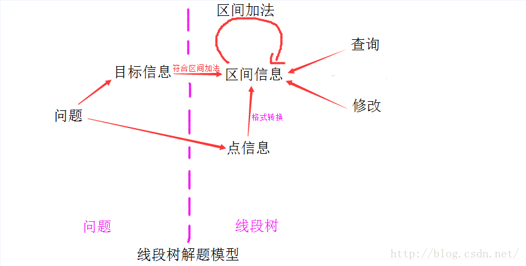
先对图中各个名字给出定义：
问题：可能可以用线段树解决的问题
目标信息：由问题转换而成的，为了解决问题而需要统计的信息（可能不满足区间加法）。
点信息：每个点储存的信息
区间信息：每个区间维护的信息（线段树节点定义） （必须满足区间加法）
区间信息包括 统计信息和标记
--------统计信息：统计节点代表的区间的信息，一般自下而上更新
--------标记：对操作进行标记（在区间修改时需要），一般自上而下传递，或者不传递
区间加法：实现区间加法的代码
查询：实现查询操作的代码
修改：实现修改操作的代码

图中紫线右边是实际线段树的实现，左边是对问题的分析以及转换。

一个问题，若能转换成对一些连续点的修改或者统计，就可以考虑用线段树解决。
首先确定目标信息和点信息，然后将目标信息转换成区间信息（必要时，增加信息，使之符合区间加法）。
之后就是线段树的代码实现了，包括：
1.区间加法 
2.建树，点信息到区间信息的转换 
3.每种操作（包括查询，修改）对区间信息的调用，修改

这样，点的信息不同，区间信息不同，线段树可以维护很多种类的信息，所以是一种非常实用的数据结构。
可以解决很多问题，下面给出几个例子来说明。

#### （1）：字符串哈希
题目：URAL1989 Subpalindromes    题解
给定一个字符串(长度<=100000)，有两个操作。   1：改变某个字符。 2：判断某个子串是否构成回文串。 
直接判断会超时。这个题目，是用线段树维护字符串哈希
对于一个字符串a[0],a[1],...,a[n-1] 它对应的哈希函数为a[0]+a[1]*K + a[2]*K^2 +...+a[n-1]*K^(n-1)
再维护一个从右往左的哈希值：a[0]*K^(n-1) + a[1]*K^(n-2) +...+a[n-1]
若是回文串，则左右的哈希值会相等。而左右哈希值相等，则很大可能这是回文串。
若出现误判，可以再用一个K2，进行二次哈希判断，可以减小误判概率。
实现上，哈希值最好对某个质数取余数，这样分布更均匀。


解题模型：
问题经过转换之后：
目标信息：某个区间的左，右哈希值
点信息：一个字符
目标信息已经符合区间加法，所以区间信息=目标信息。
所以线段树的结构为：
区间信息：区间哈希值
点信息：一个字符
代码主要需要注意2个部分：
1.区间加法 ：（PushUp函数,Pow[a]=K^a）
2.点信息->区间信息：(叶节点上，区间只包含一个点，所以需要将点信息转换成区间信息)
修改以及查询，在有了区间加法的情况下，没什么难度了。

可以看出，上述解题过程的核心，就是找到区间信息， 写好区间加法。
下面是维护区间和的部分，下面的代码没有取余，也就是实际上是对2^32取余数，这样其实分布不均匀，容易出现误判：
```cpp
#define K 137  
#define maxn 100001   
char str[maxn];  
int Pow[maxn];//K的各个次方   
struct Node{  
    int KeyL,KeyR;  
    Node():KeyL(0),KeyR(0){}  
    void init(){KeyL=KeyR=0;}  
}node[maxn<<2];  
void PushUp(int L,int R,int rt){  
    node[rt].KeyL=node[rt<<1].KeyL+node[rt<<1|1].KeyL*Pow[L];  
    node[rt].KeyR=node[rt<<1].KeyR*Pow[R]+node[rt<<1|1].KeyR;  
}  
```